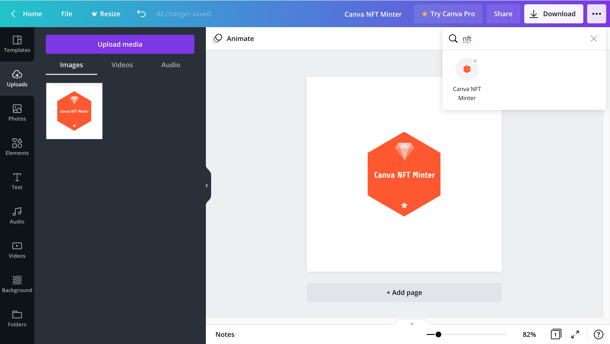
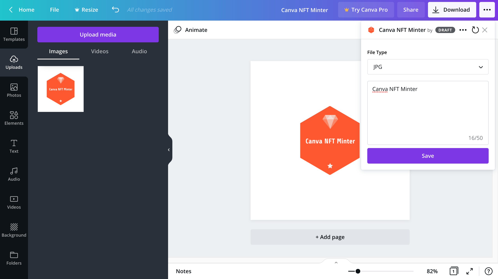
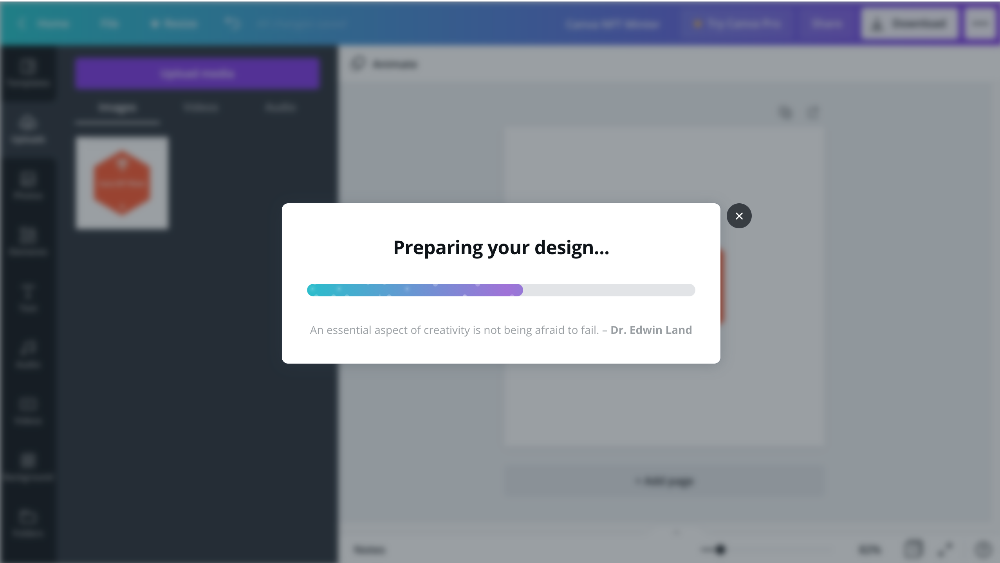
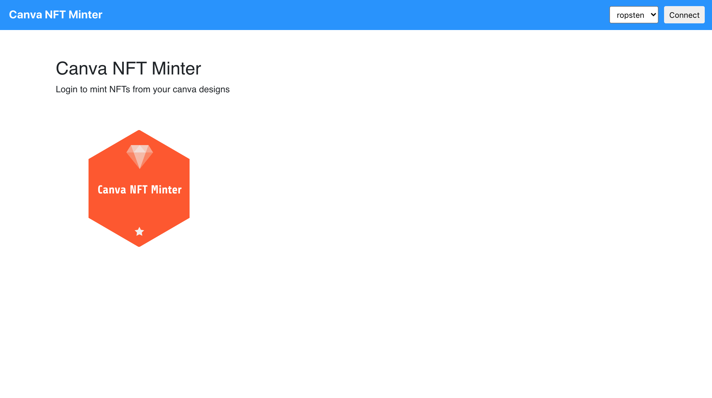
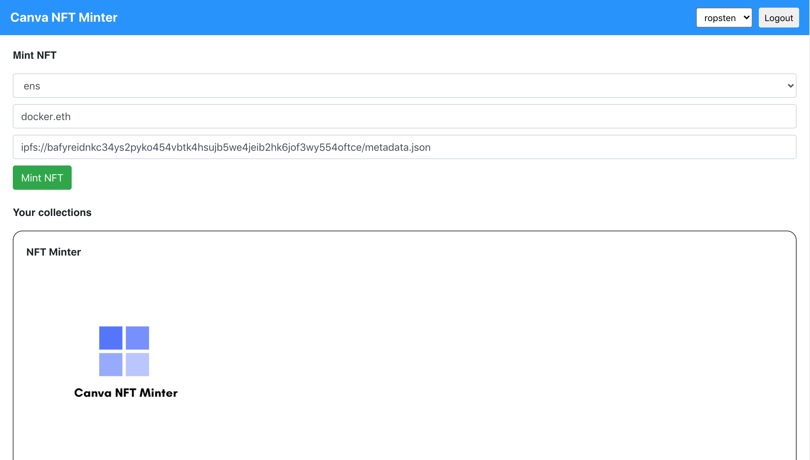
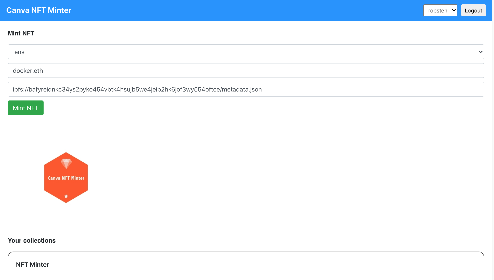
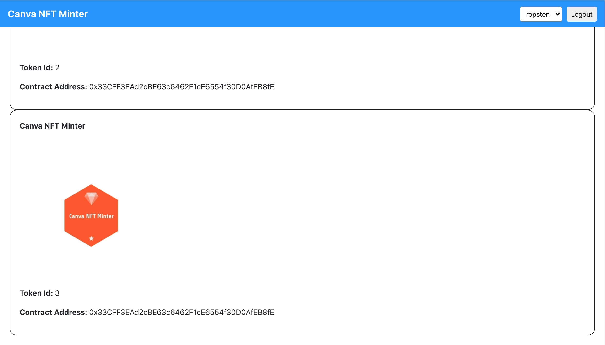

## Canva NFT Minter
Mint NFTs using your Canva designs.

### Deployment
The `frontend` app is deployed using netlify.
- https://canva-nft-minter.netlify.app/

The `backend` app is deployed using replit. 
- https://Canva-NFT-Minter.viraja1.repl.co

Then the backend base url is entered as a webhook url in the custom Canva Publish App 
- https://docs.developer.canva.com/apps/extension-points/publish-extensions
- https://docs.developer.canva.com/apps/extension-points/publish-extensions/quick-start
- https://docs.developer.canva.com/apps/extension-points/publish-extensions/messages
- https://docs.developer.canva.com/apps/extension-points/publish-extensions/published-url

This allows the Canva users to publish their designs as NFT using the custom Canva Publish app. 
The design image is first uploaded to IPFS / Filecoin. Then the user is redirected to the Canva NFT Minter frontend 
where they can mint the ERC 721 NFT and send it to an address. It also has support for Torus and ENS name resolver for 
recipient address.

### App Link
Canva NFT Minter (Ropsten or Matic Mumbai) - https://canva-nft-minter.netlify.app/

### Screenshots


















### Getting Started

1) Clone the repo

   ```
   git clone https://github.com/viraja1/canva_nft_minter.git 
   ```

2) Change Directory

   ```
   cd canva_nft_minter
   ```
   
3) Install packages

   ```
   npm install
   ```
   
4) Set environment variables for contract deployment for the selected network

   ```
   vi .env
   ```
   
   ```
   PRIVATE_KEY=
   ROPSTEN=
   MATIC_MUMBAI=wss://ws-matic-mumbai.chainstacklabs.com
   ```
   
   Replace private key with your account private key for the contract deployment.
      
   For ropsten wss endpoint, signup for an infura account - https://infura.io/

5) Send test ETH to the account associated with the private key which will be used for the contract deployment.
    
    Ropsten faucet - https://faucet.ropsten.be/
    
    Matic Mumbai faucet - https://faucet.matic.network/
    
6) Deploy the contract to the selected networks using infura

   ```
   ./node_modules/.bin/truffle compile --network {network}
   ./node_modules/.bin/truffle migrate --network {network}
   ```
   
   Run the above commands separately for each network where the contract needs to be deployed by replacing {network} 
   with `ropsten` or `matic_mumbai`.
   
   Note down the `contract address` for `NFTMinter` for each network where the contract was deployed.
   
7) Update the contract address for each network where the contract was deployed in src/App.js:15

   Also verify chainId and host for each network in src/App.js:15
   
8) Start the app   

   ```
   npm start 
   ```
   
9) Test the app

   http://localhost:3000/ 
